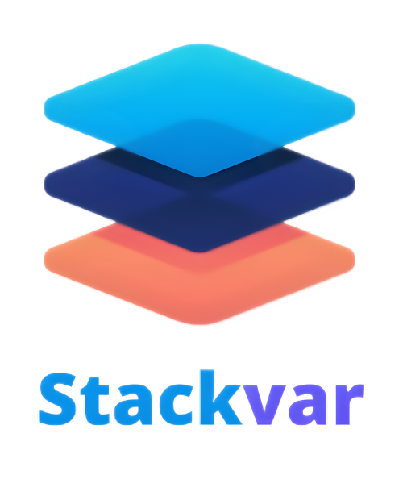

# Stackvar Language
### Development state (not ready to run)


<br><br><br>
<p align="center">
  
</p>

## About:
Stackvar is strongly typed interpreted programming language, developed in Python.
###### P.S. But also compiler is planned to be implemented.
Also, it is stack-oriented, functional language with variables!


## Some information about project and targets
I've created this project just for fun, so it's not very useful.

My main goal is simple:
I am trying to improve this lang, to make it more useful.

Of course, it can look difficult, but it's not that hard, if you got the idea.

## Idea of language
* Each function can accept values from stack, and return it to stack.
* Use stack to operate with data and store temporary values.
* Use variables to store permanent values.
* Have fun ;)

## Idea of project (Why I created this project?)
* To **try to create** *something like* **my own programming language**, because I never do this before.
* **To get knowledge** and **improve my coding skills**.

# Usage (Tutorial)
* **Each** *Stackvar* file should have "**.stv**" extension
* To learn the language, see the [Manual](manual.md).
* To learn how does it work look at [documentation](docs.txt).

To start the file, cd to src directory, and run main.py file with filename.

```shell
python3 main.py [filename].stv
```

Also, you can use "--dev" flag after filename, to see some dev information like tokens and SVIL code.


## Development milestones
- [x] Lexer
- [x] Parser
- [x] Interpreter
- [x] Variables
- [x] Builtin functions
- [ ] If-statements
- [ ] While-cycles
- [ ] For-cycles
- [ ] Functions defining
- [ ] Full testing
- [ ] Full documentation
- [ ] Stackvar 1.0.0 release

Next goals will append after 1.0.0 release . . .

## Some other info
Project is developed by one person.

Inspired by [Porth](https://gitlab.com/tsoding/porth), which is Python implementation of [Forth](https://www.forth.com/).

No code is copied.

No external modules is used.

No eval / exec is used.

<br>

##### "I hope you will enjoy it\n"; puts
